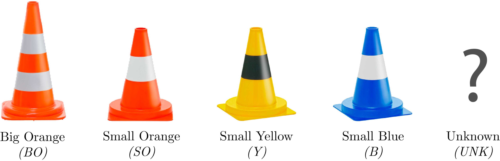
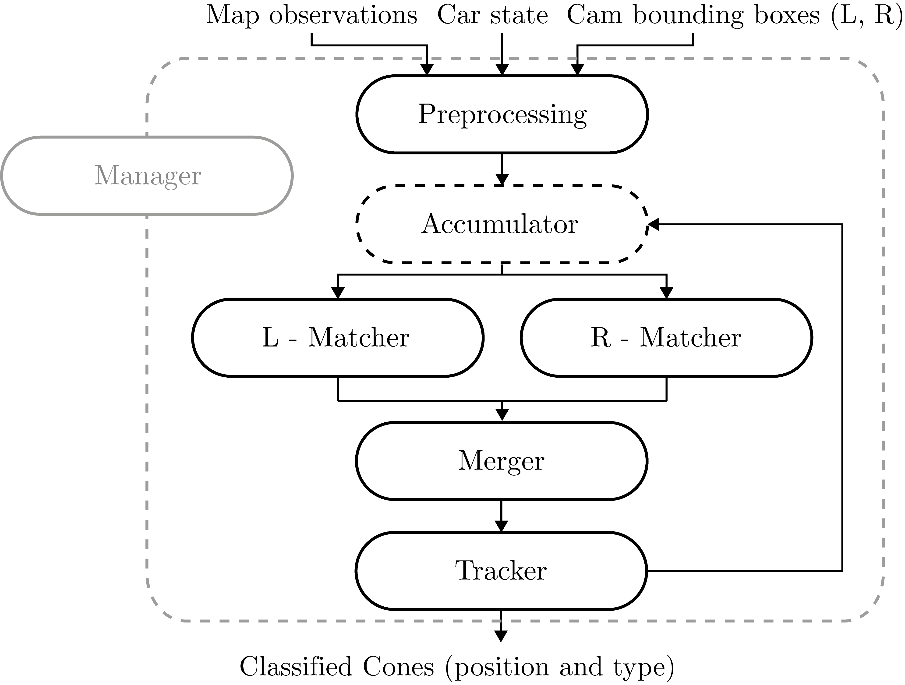
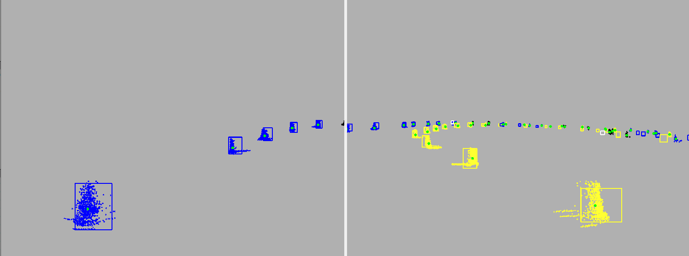
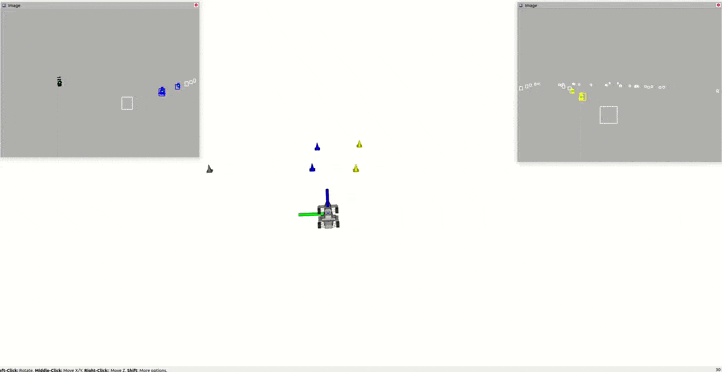

# CCAT

CCAT is a system built for the Formula Student team BCN eMotorsport in order to **classify** and **keep track** of the cones detected from a global 3D map.
    
To fulfill this purpose, CCAT implements a **sensor fusion** model. It **registers** the bounding boxes obtained from the neural network that processes the camera images to the cones detected on the 3D map that LiDAR odometry provides.
    
CCAT must obtain a vector of classified cones. Each cone should have a type $t_{ccat}$ according to the class of cone they belong to. According to [FSG](https://www.formulastudent.de/fsg/) DE 6.2.4 and as shown in *Fig. 1*, possible types are *big orange* $(BO)$, *small orange* $(SO)$, *small yellow* $(Y)$ and *small blue* $(B)$. In order to also represent the case where cone type is unknown (due to camera range or uncertainty), type *unknown* $(UNK)$ will also be a possible type.

   
  Figure 1: CCAT cone types

In addition, CCAT will make sure (as far as possible) that the cones it outputs agree with the ground truth. To do so, it will track every cone over time to robustly assign them a unique $id_{ccat}$.
    
We will set/change the decisions on the set of tracked cones only when a certain confidence is reached since, later, other algorithms will take these cones (and identify them through the $id_{ccat}$) and that will decide which path will the car take.

## Input
- An **observation vector** from the global 3D map, this includes the cone position (centroid) $p_{obs}\, (\mathbb{R}^3)$, a detection confidence $\alpha_{obs}$ and the cone's point cloud $pcl_{obs}$.\
  This is: { $(p_{obs},\alpha_{obs},pcl_{obs})$ }.
- Car \textbf{location} and \textbf{heading}, a pose 6D vector.\
  This is: $(x, y, z, \phi, \theta, \psi)$.
- Left and right camera detected \textbf{bounding boxes} of cones, including the type of cone and confidence.\
  This is: { $(x_{bb_0}, y_{bb_0}, x_{bb_1}, y_{bb_1}, t_{bb}, \alpha_{bb})$ }.

Note: In order to synchronize the data afterwards, all input messages are timestamped.

## Output
- **Classified** cone vector with class confidence and each cone will have a unique id (between iterations).\
This is: { $(p_{ccat},t_{ccat},id_{ccat},\alpha_{ccat})\mid p_{ccat} \in \mathbb{R}^3, t_{ccat} \in (Y,B,SO,BO,UNK)$ }

## Pipeline
In order to achieve the desired functionalities, the system pipeline is divided into modules to improve code readability and ensure maintainability. As shown in *Fig. 2*, there are 5 different modules, each one performs a very specific task and is designed to not have any dependency with other modules.

   
  Figure 2: CCAT pipeline module structure

### Manager
The Manager module acts as a master module; its job is to manage all incoming data and call inner pipeline with the appropriate-synchronized data.\
Tasks:
- **Synchronize** all input data.
- **Call** inner pipeline modules with valid data **only** when necessary.
- Runs all Matcher modules in **parallel** with [OpenMP](https://en.wikipedia.org/wiki/OpenMP).
- Allow real-time camera extrinsic parameters calibration on rosbag.
- Allow **one camera only** operation, e.g. a camera gets disconnected.
- Allow **LiDAR only** operation, e.g. all cameras get disconnected.

### Preprocessing
This module preprocesses all data that arrives in each iteration. The aim of this module is to filter and clean the data so all the other modules can use it directly.\
Tasks:
- **Convert** car's pose to a transformation matrix to later transform all cones to car's local frame. Make the **inverse** of this matrix (transform global-local is wanted) and **invert** $y$ coordinate.
- **Cluster** in $O(n\log n)$ all incoming 3D map observations recursively using a threshold $d_{clust}$ such that if the distance between two points is lower or equal to $d_{clust}$, they will get grouped into the same cluster. Cluster position will be the mean of all clustered cones position.

### Accumulator
The Accumulator module is a fictitious module, created as part of the Tracker module. It is a necessary step between Preprocessing and Matcher(s) since we want to match all observations (historic and new). This module relates and adds current iteration's observations to the historical (accumulated since the beginning).\
Tasks:
- **Accumulate** LiDAR observations with existing tracked cones such that for every new observation $obs_i$ with position $p_{obs_i}$:
    - If there is an existing cone $c_j$ with position $p_{c_j}$ and $dist(p_{obs}, p_{c_j}) \leq d_{acc}$, it is assumed that $obs_i$ is another observation of $c_j$. In this case, only the position is updated (latest data is more representative).
    - Otherwise it is assumed that $obs_i$ is the first observation of a new cone. In this case, a new cone with position $p_{obs_i}$ is created on the system.
- Give every cone a **unique id**: Every time a new cone is observed, a new id is given (an increment of last id given).
- **Transform** every cone's position from global into **local** (with the use of car's location and heading).

### Matcher
The Matcher module is responsible for the **projections** and **matchings** between the camera bounding boxes and the system's cones. In addition, it also keeps **camera parameters** (intrinsics and extrinsics) and allow real-time extrinsics calibration.\
Tasks:
- **Transform** every cone's local position into **camera space** through the camera extrinsic parameters.
- **Transform** every cone's camera position into **image space** through the camera intrinsic parameters (pinhole model).
- **Remove** all cones whose position is not **in-frame** (behind the car or not caught on camera).
- For each projected cone, **match** it with the closest camera bounding box within a maximum distance threshold $d_{match_{max}}$ using a $k$-d tree in $O(\log n)$.
- Save a list of **cone updates**, that is a list containing all cone $id$s and:
    - matching distance $(d_{match})$ and matched type $(t_{match})$ if the cone has a matching.
    - global distance to closest matched cone $(d_{cl_{match}})$ otherwise.

Result can be visualized in *Fig. 3*.

   
  Figure 3: CCAT left and right image projections and matchings

### Merger
The Merger module is in charge of merging the output of the two Merger modules. This is necessary because the two Matchers can output the same cone due to the small zone of overlap between the two cameras; i.e. the same cone can be detected by the two cameras.\
Tasks:
**Merge** all Matchers' output into one single list such that there are no two cones with same $id$.
- If multiple cones with same $id$s are found, the one with a smaller matching distance $(d_{match})$ will prevail.

### Tracker
The Tracker module is the only module in which cones are stored between iterations. The objective of this module is to keep track of all observations and decide which one should be output and the type of it.\
Tasks:
- **Store all cones**. That is all historical observations.
- For every cone, **decide** whether or not it is an existing cone and its **type**.
- **Convert** all data into ROS message data (serializable and readable by another node).

## Result
The result is quite impressive. As shown in *Fig. 4* on the left and right hand side there are the projected images at real time and at the center the cone markers being updated.

   
  Figure 4: CCAT left projections, markers and right projections

